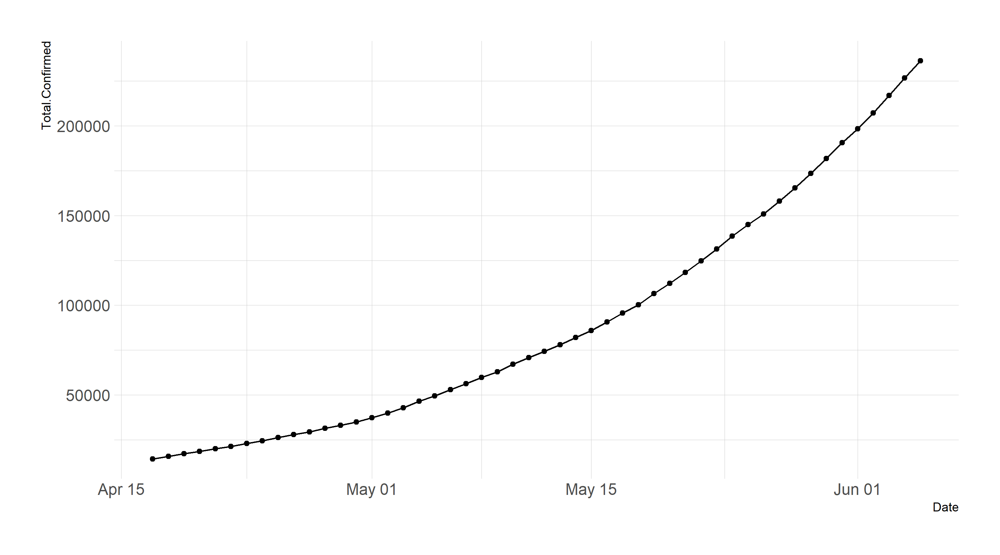
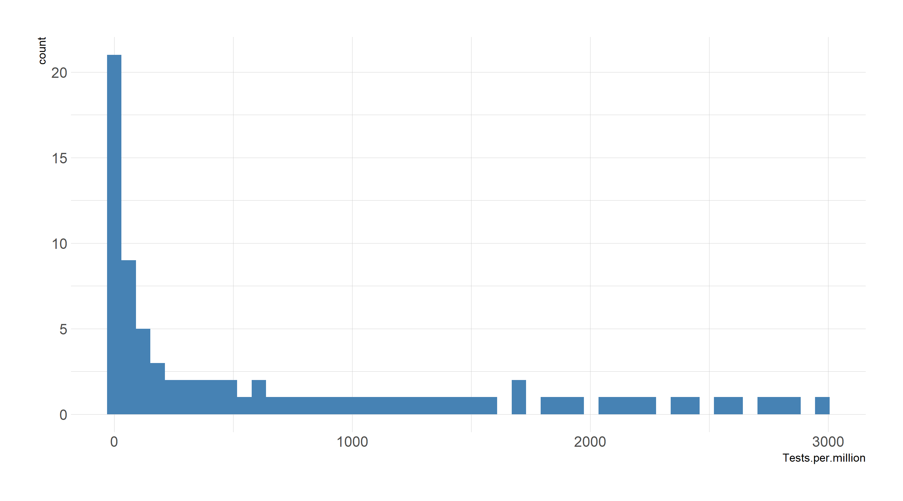
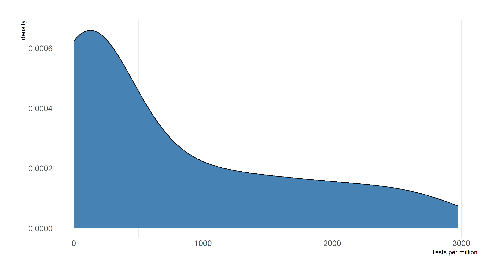
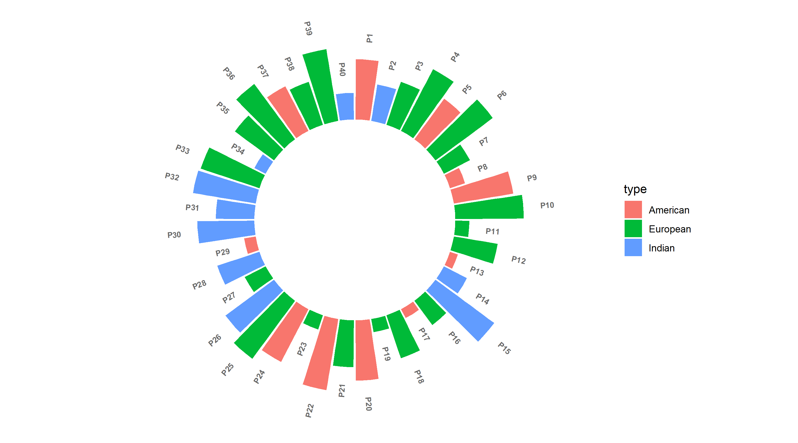

# R ggplot / tidyverse plot examples

A work-in-progress compilation of plots created with reproducible data to be used as a ready-reference for plots that can be easily created using the tidyverse.

#### Plots added so far:
- ***line_plots***
	- connected_line.R
- ***bar_plots***
	- circular_bar.R
- ***distribution plots***
	- simple_density.R
	- simple_histogram.R
	
# Example Plots
#### Connected Line Plot

#### Simple Histogram and Density Plot

#### Circular Bar Plot

